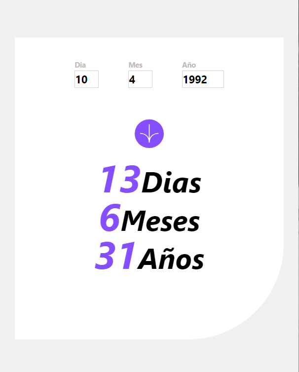

# Frontend Mentor - Age calculator app solution

This is a solution to the [Age calculator app challenge on Frontend Mentor](https://www.frontendmentor.io/challenges/age-calculator-app-dF9DFFpj-Q). Frontend Mentor challenges help you improve your coding skills by building realistic projects. 

### Screenshot

### Links

- Solution URL: [repositorio](https://github.com/Breynersmith/calculadora-de-edad.git)
- Live Site URL: [ver](https://breynersmith.github.io/calculadora-de-edad/)

### Built with

- Flexbox
- Mobile-first workflow
- [vue](https://vuejs.org/) - JS library
- [vite](https://vite.org/) 
- [TailwindCss](https://tailwindcss.com/) - For styles

